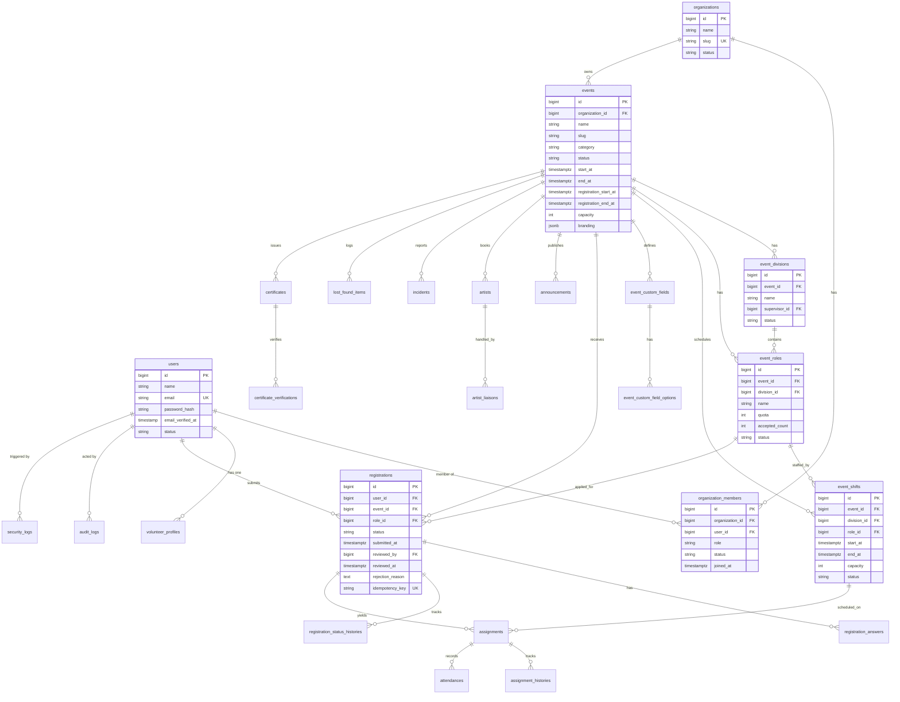

# DATABASE

PostgreSQL 16+ sebagai primary dan satu-satunya sumber kebenaran.
Manfaatkan: foreign key, unique (termasuk parsial), check constraint,
index, transaction, `SELECT ... FOR UPDATE`.

Konvensi: `id` bigint PK, `timestamps`, soft deletes (`deleted_at`) untuk
tabel operasional/audit penting, `ulid`/string untuk token publik
(sertifikat, QR) — bukan sebagai pengganti otorisasi.

## 1. ERD

## 2. Tabel per Domain

### Identity & Tenancy

- **users**: `name`, `email` (unique, citext disarankan), `password`
  (hash-only), `email_verified_at`, `status`
  (`active`, `suspended`), `last_login_at`. Index: `email`, `status`.
- **organizations**: `name`, `slug` (unique global), `logo_path`,
  `description`, `email`, `phone`, `website`, `social_links` (jsonb),
  `status` (`active`, `suspended`, `archived`), soft deletes.
- **organization_members**: `organization_id`, `user_id`, `role`
  (`owner`, `staff` — check constraint), `status`, `joined_at`.
  Unique `(organization_id, user_id)`. Index: `(user_id)`.
- **Spatie** (standar package): `roles`, `permissions`,
  `model_has_roles`, `model_has_permissions`, `role_has_permissions`.
  Role global hanya `super_admin`; permission granular
  (`event.update`, `registration.review`, ...).

### Events

- **events**: kolom §ERD + `venue`, `address`, `latitude`, `longitude`,
  `timezone`, `banner_path`, `thumbnail_path`, `contact` (jsonb),
  `terms`, `privacy_notice`, `published_at`, soft deletes.
  Unique `(organization_id, slug)`. Index: `(organization_id, status)`,
  `(status, start_at)`, GIN `branding` bila difilter.
  Check: `end_at > start_at`,
  `registration_start_at < registration_end_at`.
- **event_divisions**: `event_id`, `name`, `description`,
  `supervisor_id → users`, `status`. Unique `(event_id, name)`.
- **event_roles**: `event_id`, `division_id`, `name`, `description`,
  `quota`, **`accepted_count` default 0**, `requirements` (jsonb),
  `location`, `status`. Unique `(event_id, division_id, name)`.
  Check: `quota >= 0`, `accepted_count >= 0`, `accepted_count <= quota`.
- **event_shifts**: `event_id`, `division_id`, `role_id`, `start_at`,
  `end_at`, `location`, `capacity`, `supervisor_id → users`, `status`.
  Check: `end_at > start_at`, `capacity >= 0`.
  Index: `(event_id, start_at)`, `(role_id, start_at)`.
- **event_custom_fields**: `event_id`, `label`, `type` (check: 13 tipe
  di PRD §7), `required`, `placeholder`, `validation_rule`,
  `sort_order`, `is_active`.
- **event_custom_field_options**: `field_id`, `label`, `value`,
  `sort_order`. Untuk select/radio/checkbox/multi-select.

### Volunteer & Recruitment

- **volunteer_profiles**: `user_id` (unique), `full_name`, `phone`,
  `city`, `education`, `experience`, `skills` (jsonb/text[]),
  `portfolio_url`, `social_links` (jsonb), `availability` (jsonb),
  `visibility` (`public`, `organizers_only`, `private`).
  Data minimization: `date_of_birth` & emergency contact hanya bila
  event mensyaratkan (kolom nullable, diakses via policy).
- **registrations**: kolom §ERD + `reviewed_by → users`.
  **Unique parsial** mencegah duplikat aktif:
  `UNIQUE (user_id, event_id) WHERE status IN
  ('pending','under_review','accepted','waitlisted')`.
  Index: `(event_id, status)`, `(role_id, status)`, `(user_id)`.
- **registration_answers**: `registration_id`, `field_id`, `value_text`,
  `value_jsonb` (untuk multi/file), `file_path` (bila tipe file).
  Unique `(registration_id, field_id)`.
- **registration_status_histories**: `registration_id`, `from_status`,
  `to_status`, `changed_by → users`, `reason`, `created_at`.
  Append-only (tanpa update/delete oleh aplikasi).

### Operations

- **assignments**: `registration_id` (unique — satu assignment aktif per
  registration), `user_id`, `event_id`, `division_id`, `role_id`,
  `shift_id` (nullable), `location`, `supervisor_id → users`,
  `status` (`assigned`, `reassigned`, `confirmed`, `completed`,
  `cancelled`), soft deletes. Index: `(event_id, status)`,
  `(user_id, event_id)`, `(shift_id)`.
- **assignment_histories**: `assignment_id`, `from_status`, `to_status`,
  `changed_by`, `note`, `created_at`. Append-only.
- **attendances**: `assignment_id`, `shift_id`, `event_id`, `user_id`,
  `checked_in_at`, `checked_out_at`, `method` (`qr`, `manual`),
  `status` (`present`, `late`, `absent`), `idempotency_key` (unique).
  Unique `(assignment_id, shift_id)` — satu record per pasangan.
  Index: `(event_id, checked_in_at)`, `(user_id, event_id)`.
- **attendance_logs**: `attendance_id`, `action` (`check_in`,
  `check_out`, `void`), `actor_id`, `ip`, `user_agent`, `created_at`.
  Append-only.

### Komunikasi

- **announcements**: `event_id`, `author_id → users`,
  `target_type` (`event`, `division`, `role`, `shift`, `individual`),
  `target_id` (nullable), `title`, `body`, `published_at`, `expires_at`.
  Index: `(event_id, published_at)`.
- **notifications**: standar Laravel (`notifiables` polymorphic, `data`
  jsonb, `read_at`). Channel database+mail dulu.

### Modul Event Musik

- **artists**: `event_id`, `name`, `arrival_at`, `departure_at`, `venue`,
  `transport` (jsonb), `requirements` (jsonb), `status`.
- **artist_liaisons**: `artist_id`, `user_id` (liaison), `note`.
  Unique `(artist_id, user_id)`. Akses dibatasi policy
  (liaison ter-assign + staff ber-permission).
- **incidents**: `event_id`, `category` (check: medical, security, crowd,
  technical, lost_found, other), `priority` (check: low–critical),
  `location`, `description`, `attachment_path`, `reporter_id → users`,
  `assignee_id → users`, `status` (check: open→…→closed), soft deletes.
  Index: `(event_id, status)`, `(event_id, priority)`.
- **lost_found_items**: `event_id`, `kind` (`lost`, `found`), `item_name`,
  `description`, `photo_path`, `location`, `occurred_at`,
  `reporter_id → users`, `handler_id → users`, `status`.

### Kredensial & Logging

- **certificates**: `event_id`, `user_id`, `registration_id` (unique),
  `certificate_no` (unique, mis. `WV-2026-XXXXXX`), `issued_at`,
  `revoked_at`, `qr_token_hash` (unique). Unique `(event_id, user_id)`.
- **certificate_verifications**: `certificate_id`, `verified_at`, `ip`,
  `user_agent`. Append-only (jejak verifikasi publik).
- **audit_logs**: `actor_id`, `organization_id` (nullable),
  `event_id` (nullable), `action`, `resource_type`, `resource_id`,
  `old_values`/`new_values` (jsonb), `ip`, `user_agent`, `request_id`,
  `created_at`. Append-only. Index: `(event_id, created_at)`,
  `(actor_id, created_at)`, `(action)`.
- **security_logs**: `actor_id` (nullable), `type` (`failed_login`,
  `account_locked`, `forbidden_access`, `rate_limit_exceeded`, ...),
  `ip`, `user_agent`, `context` (jsonb, tanpa secret), `created_at`.
  Append-only. Index: `(type, created_at)`, `(ip, created_at)`.

## 3. Transaction Wajib

Registration submit, accept/reject/waitlist, assign/reassign, quota
update, cancel registration, check-in/out, bulk action, generate
certificate. Pola: `DB::transaction()` + lock baris quota
(`lockForUpdate()` pada `event_roles`) di dalam `QuotaService`.
Kegagalan → rollback penuh, state konsisten.

## 4. Idempotency

`registrations.idempotency_key` (UUID dari client per submit, unique)
dan `attendances.idempotency_key` per aksi check-in/out.
Double-click/retry dengan key sama → kembalikan record existing,
tanpa duplikat. Key kedaluwarsa dibersihkan via scheduler.

## 5. Retensi & Soft Delete

Soft delete: organizations, events, assignments, incidents.
Append-only (tanpa delete aplikasi): status histories, attendance_logs,
audit_logs, security_logs, certificate_verifications.
Kebijakan retensi configurable (registration history, attendance, log,
file upload); hard delete hanya via perintah artisan teraudit oleh
Super Admin.
